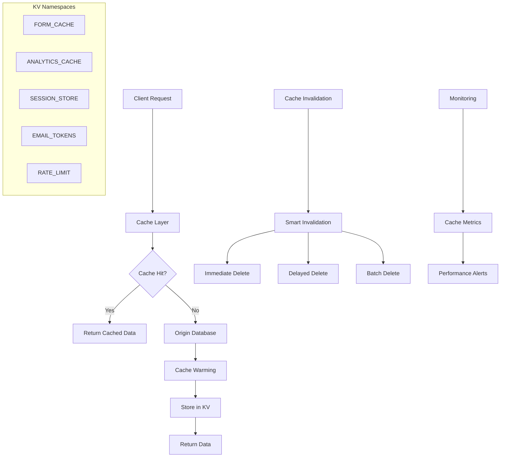

# KV Cache Optimization Implementation Guide

This guide provides specific code implementations and diagrams for the FormWeaver KV cache optimizations.

## Architecture Overview



## 1. TTL Optimization Implementation

### Dynamic TTL Calculator

```typescript
// backend/src/utils/cacheTTL.ts
export interface TTLConfig {
  default: number;
  max: number;
  min: number;
}

export class TTLManager {
  private static readonly FORM_TTL_CONFIG: TTLConfig = {
    default: 600,  // 10 minutes
    max: 1800,     // 30 minutes
    min: 300       // 5 minutes
  };

  private static readonly ANALYTICS_TTL_CONFIG: TTLConfig = {
    default: 3600, // 1 hour
    max: 7200,     // 2 hours
    min: 300       // 5 minutes
  };

  /**
   * Calculate dynamic TTL for forms based on usage patterns
   */
  static getFormTTL(form: {
    status: 'published' | 'draft' | 'archived';
    viewCount?: number;
    lastUpdated?: number;
    isPopular?: boolean;
  }): number {
    let baseTTL = this.FORM_TTL_CONFIG.default;

    // Status-based adjustments
    switch (form.status) {
      case 'published':
        baseTTL = form.isPopular ? 1800 : 900; // 30min for popular, 15min for regular
        break;
      case 'draft':
        baseTTL = 300; // 5 minutes for drafts (frequent changes)
        break;
      case 'archived':
        baseTTL = 3600; // 1 hour for archived (rarely accessed)
        break;
    }

    // View count adjustments
    if (form.viewCount && form.viewCount > 1000) {
      baseTTL += 300; // +5 minutes for high-traffic forms
    } else if (form.viewCount && form.viewCount < 100) {
      baseTTL -= 180; // -3 minutes for low-traffic forms
    }

    // Recency adjustments
    if (form.lastUpdated) {
      const hoursSinceUpdate = (Date.now() - form.lastUpdated) / (1000 * 60 * 60);
      if (hoursSinceUpdate < 1) {
        baseTTL = Math.min(baseTTL, 600); // Cap at 10 minutes for recent updates
      } else if (hoursSinceUpdate > 24) {
        baseTTL = Math.max(baseTTL, 1200); // Minimum 20 minutes for stale data
      }
    }

    return Math.max(
      this.FORM_TTL_CONFIG.min,
      Math.min(this.FORM_TTL_CONFIG.max, baseTTL)
    );
  }

  /**
   * Calculate dynamic TTL for analytics based on data type and recency
   */
  static getAnalyticsTTL(dataType: 'realtime' | 'daily' | 'weekly' | 'historical', 
                        dateRange: { from?: number; to?: number }): number {
    let baseTTL = this.ANALYTICS_TTL_CONFIG.default;

    // Data type adjustments
    switch (dataType) {
      case 'realtime':
        baseTTL = 300; // 5 minutes for real-time data
        break;
      case 'daily':
        baseTTL = 1800; // 30 minutes for daily aggregates
        break;
      case 'weekly':
        baseTTL = 3600; // 1 hour for weekly data
        break;
      case 'historical':
        baseTTL = 7200; // 2 hours for historical data
        break;
    }

    // Date range adjustments
    if (dateRange.to) {
      const daysAgo = (Date.now() - dateRange.to) / (1000 * 60 * 60 * 24);
      
      if (daysAgo < 1) {
        // Very recent data - shorter TTL
        baseTTL = Math.min(baseTTL, 900);
      } else if (daysAgo > 30) {
        // Old data - longer TTL
        baseTTL = Math.max(baseTTL, 3600);
      }
    }

    return Math.max(
      this.ANALYTICS_TTL_CONFIG.min,
      Math.min(this.ANALYTICS_TTL_CONFIG.max, baseTTL)
    );
  }

  /**
   * Calculate sliding TTL for sessions based on activity
   */
  static getSessionTTL(lastActivity: number, sessionType: 'refresh' | 'access'): number {
    const daysSinceActivity = (Date.now() - lastActivity) / (1000 * 60 * 60 * 24);
    
    if (sessionType === 'refresh') {
      if (daysSinceActivity < 7) {
        return 2592000; // 30 days for recently active users
      } else if (daysSinceActivity < 14) {
        return 1296000; // 15 days for moderately active users
      } else {
        return 604800; // 7 days for inactive users
      }
    } else {
      // Access tokens have shorter lifespans
      return 3600; // 1 hour
    }
  }
}
```

## 2. Enhanced Cache Invalidation System

### Smart Invalidation Manager

```typescript
// backend/src/utils/cacheInvalidation.ts
export interface InvalidationStrategy {
  immediate?: string[];
  delayed?: { keys: string[]; delay: number };
  batch?: string[];
  conditional?: (context: any) => boolean;
}

export class CacheInvalidationManager {
  private static readonly INVALIDATION_STRATEGIES: Record<string, InvalidationStrategy> = {
    'form-schema-update': {
      immediate: ['form:{formId}'],
      delayed: { keys: ['analytics:{formId}:*'], delay: 5000 },
      batch: ['workspace-analytics:{workspaceId}:*']
    },
    'form-status-change': {
      immediate: ['form:{formId}'],
      delayed: { keys: ['analytics:{formId}:*'], delay: 2000 }
    },
    'form-settings-update': {
      immediate: ['form:{formId}'],
      conditional: (context) => context.affectsCache === true
    },
    'submission-created': {
      delayed: { keys: ['analytics:{formId}:*'], delay: 1000 },
      batch: ['workspace-analytics:{workspaceId}:*']
    }
  };

  /**
   * Execute smart cache invalidation
   */
  static async invalidate(
    strategyName: string,
    context: {
      formId?: string;
      workspaceId?: string;
      userId?: string;
      [key: string]: any;
    },
    env: Env
  ): Promise<void> {
    const strategy = this.INVALIDATION_STRATEGIES[strategyName];
    if (!strategy) {
      throw new Error(`Unknown invalidation strategy: ${strategyName}`);
    }

    // Execute conditional logic
    if (strategy.conditional && !strategy.conditional(context)) {
      return; // Skip invalidation based on conditions
    }

    // Immediate invalidation
    if (strategy.immediate?.length) {
      await this.immediateInvalidate(strategy.immediate, context, env);
    }

    // Batch invalidation
    if (strategy.batch?.length) {
      await this.batchInvalidate(strategy.batch, context, env);
    }

    // Delayed invalidation
    if (strategy.delayed) {
      setTimeout(async () => {
        await this.delayedInvalidate(strategy.delayed!.keys, context, env);
      }, strategy.delayed.delay);
    }
  }

  private static async immediateInvalidate(
    keys: string[],
    context: any,
    env: Env
  ): Promise<void> {
    const resolvedKeys = keys.map(key => this.resolveKeyTemplate(key, context));
    
    try {
      await env.FORM_CACHE.delete(resolvedKeys);
      console.log(`[Cache Invalidation] Immediately invalidated: ${resolvedKeys.join(', ')}`);
    } catch (error) {
      console.error('[Cache Invalidation] Immediate invalidation failed:', error);
    }
  }

  private static async batchInvalidate(
    patterns: string[],
    context: any,
    env: Env
  ): Promise<void> {
    for (const pattern of patterns) {
      const resolvedPattern = this.resolveKeyTemplate(pattern, context);
      await this.invalidateByPattern(resolvedPattern, env);
    }
  }

  private static async delayedInvalidate(
    keys: string[],
    context: any,
    env: Env
  ): Promise<void> {
    const resolvedKeys = keys.map(key => this.resolveKeyTemplate(key, context));
    
    try {
      await env.ANALYTICS_CACHE.delete(resolvedKeys);
      console.log(`[Cache Invalidation] Delayed invalidation completed: ${resolvedKeys.join(', ')}`);
    } catch (error) {
      console.error('[Cache Invalidation] Delayed invalidation failed:', error);
    }
  }

  private static async invalidateByPattern(pattern: string, env: Env): Promise<void> {
    try {
      const listResult = await env.FORM_CACHE.list({ prefix: pattern.replace('*','') });
      const keysToDelete = listResult.keys.map(key => key.name);
      
      if (keysToDelete.length > 0) {
        await env.FORM_CACHE.delete(keysToDelete);
        console.log(`[Cache Invalidation] Batch deleted ${keysToDelete.length} keys matching pattern: ${pattern}`);
      }
    } catch (error) {
      console.error(`[Cache Invalidation] Pattern deletion failed for ${pattern}:`, error);
    }
  }

  private static resolveKeyTemplate(template: string, context: any): string {
    return template.replace(/{(\w+)}/g, (match, key) => context[key] || match);
  }
}
```

## 3. Bulk Operations Implementation

### Optimized Cache Operations

```typescript
// backend/src/utils/cacheOperations.ts
export class BulkCacheOperations {
  /**
   * Get multiple forms with fallback handling
   */
  static async getMultipleForms(
    formIds: string[],
    env: Env,
    fetcher: (formId: string) => Promise<any>
  ): Promise<Record<string, any>> {
    const keys = formIds.map(id => `form:${id}`);
    
    try {
      // Single bulk operation instead of multiple individual gets
      const results = await env.FORM_CACHE.get(keys);
      const forms: Record<string, any> = {};
      const missingKeys: string[] = [];

      // Process cached results
      for (const [key, value] of results) {
        if (value !== null) {
          const formId = key.split(':')[1];
          forms[formId] = JSON.parse(value);
        } else {
          const formId = key.split(':')[1];
          missingKeys.push(formId);
        }
      }

      // Fetch missing forms individually
      if (missingKeys.length > 0) {
        const fetchPromises = missingKeys.map(async (formId) => {
          try {
            const form = await fetcher(formId);
            forms[formId] = form;
            
            // Cache the fetched form
            await env.FORM_CACHE.put(`form:${formId}`, JSON.stringify(form), {
              expirationTtl: TTLManager.getFormTTL(form)
            });
            
            return form;
          } catch (error) {
            console.error(`[Bulk Cache] Failed to fetch form ${formId}:`, error);
            return null;
          }
        });

        await Promise.all(fetchPromises);
      }

      return forms;
    } catch (error) {
      console.error('[Bulk Cache] Bulk get operation failed:', error);
      // Fallback to individual operations
      return this.fallbackGetForms(formIds, env, fetcher);
    }
  }

  /**
   * Cache warming after form updates
   */
  static async warmFormCache(
    formId: string,
    freshData: any,
    env: Env
  ): Promise<void> {
    try {
      const ttl = TTLManager.getFormTTL(freshData);
      
      // Store main form data
      await env.FORM_CACHE.put(`form:${formId}`, JSON.stringify(freshData), {
        expirationTtl: ttl
      });

      // Store composite metadata if applicable
      if (freshData.metadata) {
        await env.FORM_CACHE.put(`form-metadata:${formId}`, JSON.stringify({
          config: freshData.config,
          settings: freshData.settings,
          version: freshData.version,
          lastUpdated: Date.now()
        }), {
          expirationTtl: Math.min(ttl, 1800) // Max 30 minutes for metadata
        });
      }

      console.log(`[Cache Warming] Warmed cache for form ${formId} with ${ttl}s TTL`);
    } catch (error) {
      console.error(`[Cache Warming] Failed to warm cache for form ${formId}:`, error);
    }
  }

  /**
   * Batch analytics cache invalidation
   */
  static async batchInvalidateAnalytics(
    formIds: string[],
    env: Env
  ): Promise<void> {
    const keysToInvalidate: string[] = [];

    // Generate analytics cache keys to invalidate
    for (const formId of formIds) {
      keysToInvalidate.push(
        `analytics:${formId}:*`, // All analytics for the form
        `workspace-analytics:*`   // All workspace analytics
      );
    }

    // Process in batches of 100
    for (let i = 0; i < keysToInvalidate.length; i += 100) {
      const batch = keysToInvalidate.slice(i, i + 100);
      
      try {
        await Promise.all(batch.map(async (pattern) => {
          const listResult = await env.ANALYTICS_CACHE.list({ prefix: pattern.replace('*','') });
          const keysToDelete = listResult.keys.map(key => key.name);
          
          if (keysToDelete.length > 0) {
            await env.ANALYTICS_CACHE.delete(keysToDelete);
          }
        }));

        console.log(`[Batch Invalidation] Processed batch ${i/100 + 1} of ${Math.ceil(keysToInvalidate.length/100)}`);
      } catch (error) {
        console.error(`[Batch Invalidation] Failed batch ${i/100 + 1}:`, error);
      }
    }
  }

  private static async fallbackGetForms(
    formIds: string[],
    env: Env,
    fetcher: (formId: string) => Promise<any>
  ): Promise<Record<string, any>> {
    const forms: Record<string, any> = {};

    for (const formId of formIds) {
      try {
        const cached = await env.FORM_CACHE.get(`form:${formId}`, 'json');
        if (cached !== null) {
          forms[formId] = cached;
        } else {
          const form = await fetcher(formId);
          forms[formId] = form;
          
          await env.FORM_CACHE.put(`form:${formId}`, JSON.stringify(form), {
            expirationTtl: 600 // Default TTL
          });
        }
      } catch (error) {
        console.error(`[Fallback Cache] Failed to get form ${formId}:`, error);
      }
    }

    return forms;
  }
}
```

## 4. Monitoring and Metrics System

### Cache Performance Monitor

```typescript
// backend/src/utils/cacheMonitor.ts
export interface CacheMetrics {
  hits: number;
  misses: number;
  errors: number;
  totalOperations: number;
  averageResponseTime: number;
  costOperations: number;
  lastReset: number;
}

export class CacheMonitor {
  private metrics: Map<string, CacheMetrics> = new Map();
  private operationTimers: Map<string, number> = new Map();
  private readonly METRICS_RESET_INTERVAL = 3600000; // 1 hour

  /**
   * Start timing an operation
   */
  startOperation(namespace: string, key: string): void {
    const operationId = `${namespace}:${key}:${Date.now()}`;
    this.operationTimers.set(operationId, Date.now());
  }

  /**
   * Record a cache hit
   */
  recordHit(namespace: string, key: string): void {
    this.updateMetrics(namespace, { hits: 1, totalOperations: 1 });
    this.recordResponseTime(namespace, key);
  }

  /**
   * Record a cache miss
   */
  recordMiss(namespace: string, key: string): void {
    this.updateMetrics(namespace, { misses: 1, totalOperations: 1 });
    this.recordResponseTime(namespace, key);
  }

  /**
   * Record a cache error
   */
  recordError(namespace: string, key: string): void {
    this.updateMetrics(namespace, { errors: 1, totalOperations: 1, costOperations: 1 });
    this.recordResponseTime(namespace, key);
  }

  /**
   * Record response time for an operation
   */
  private recordResponseTime(namespace: string, key: string): void {
    const operationId = `${namespace}:${key}:*`;
    const matchingTimer = Array.from(this.operationTimers.entries())
      .find(([id]) => id.startsWith(operationId));

    if (matchingTimer) {
      const [operationId, startTime] = matchingTimer;
      const responseTime = Date.now() - startTime;
      
      // Update average response time
      const currentMetrics = this.metrics.get(namespace) || this.getDefaultMetrics();
      const newTotalOps = currentMetrics.totalOperations;
      const newAvgTime = ((currentMetrics.averageResponseTime * (newTotalOps - 1)) + responseTime) / newTotalOps;
      
      this.updateMetrics(namespace, { averageResponseTime: newAvgTime });
      this.operationTimers.delete(operationId);
    }
  }

  /**
   * Get current metrics for a namespace
   */
  getMetrics(namespace: string): CacheMetrics | null {
    this.ensureMetricsExist(namespace);
    return this.metrics.get(namespace) || null;
  }

  /**
   * Get cache hit rate for a namespace
   */
  getHitRate(namespace: string): number {
    const metrics = this.getMetrics(namespace);
    if (!metrics || metrics.totalOperations === 0) return 0;
    
    return metrics.hits / metrics.totalOperations;
  }

  /**
   * Get cost efficiency (operations per dollar)
   */
  getCostEfficiency(namespace: string): number {
    const metrics = this.getMetrics(namespace);
    if (!metrics || metrics.costOperations === 0) return 0;
    
    // Assuming $0.50 per million operations
    const costPerOperation = 0.0000005;
    return metrics.costOperations * costPerOperation;
  }

  /**
   * Get all metrics
   */
  getAllMetrics(): Record<string, CacheMetrics> {
    const allMetrics: Record<string, CacheMetrics> = {};
    
    for (const namespace of this.metrics.keys()) {
      allMetrics[namespace] = this.getMetrics(namespace)!;
    }
    
    return allMetrics;
  }

  /**
   * Reset metrics for a namespace
   */
  resetMetrics(namespace: string): void {
    this.metrics.set(namespace, this.getDefaultMetrics());
  }

  /**
   * Check if metrics need resetting
   */
  private ensureMetricsExist(namespace: string): void {
    if (!this.metrics.has(namespace)) {
      this.metrics.set(namespace, this.getDefaultMetrics());
    } else {
      const metrics = this.metrics.get(namespace)!;
      if (Date.now() - metrics.lastReset > this.METRICS_RESET_INTERVAL) {
        this.resetMetrics(namespace);
      }
    }
  }

  /**
   * Get default metrics structure
   */
  private getDefaultMetrics(): CacheMetrics {
    return {
      hits: 0,
      misses: 0,
      errors: 0,
      totalOperations: 0,
      averageResponseTime: 0,
      costOperations: 0,
      lastReset: Date.now()
    };
  }

  /**
   * Generate cache performance report
   */
  generateReport(): string {
    const allMetrics = this.getAllMetrics();
    let report = '\n=== Cache Performance Report ===\n\n';

    for (const [namespace, metrics] of Object.entries(allMetrics)) {
      const hitRate = this.getHitRate(namespace);
      const cost = this.getCostEfficiency(namespace);
      
      report += `Namespace: ${namespace}\n`;
      report += `  Hit Rate: ${(hitRate * 100).toFixed(2)}%\n`;
      report += `  Total Operations: ${metrics.totalOperations}\n`;
      report += `  Average Response Time: ${metrics.averageResponseTime.toFixed(2)}ms\n`;
      report += `  Cost: $${cost.toFixed(6)}\n`;
      report += `  Errors: ${metrics.errors}\n\n`;
    }

    return report;
  }
}

// Global monitor instance
export const cacheMonitor = new CacheMonitor();
```

## 5. Enhanced Error Handling

### Robust Cache Wrapper

```typescript
// backend/src/utils/robustCache.ts
export interface CacheResult<T> {
  data: T | null;
  fromCache: boolean;
  error?: Error;
  metadata?: {
    responseTime: number;
    retryCount: number;
  };
}

export class RobustCache {
  private static readonly MAX_RETRIES = 3;
  private static readonly RETRY_DELAYS = [100, 200, 400]; // Exponential backoff

  /**
   * Get data with robust error handling and fallbacks
   */
  static async get<T>(
    key: string,
    fetcher: () => Promise<T>,
    env: Env,
    options: {
      namespace?: 'FORM_CACHE' | 'ANALYTICS_CACHE' | 'SESSION_STORE';
      fallbackToDatabase?: boolean;
      retryEnabled?: boolean;
      warmCache?: boolean;
    } = {}
  ): Promise<CacheResult<T>> {
    const {
      namespace = 'FORM_CACHE',
      fallbackToDatabase = true,
      retryEnabled = true,
      warmCache = true
    } = options;

    const ns = env[namespace];
    const startTime = Date.now();

    // Try cache first
    try {
      const cached = await ns.get(key, 'json');
      if (cached !== null) {
        const responseTime = Date.now() - startTime;
        cacheMonitor.recordHit(namespace, key);
        
        return {
          data: cached,
          fromCache: true,
          metadata: { responseTime, retryCount: 0 }
        };
      }
      
      cacheMonitor.recordMiss(namespace, key);
    } catch (cacheError) {
      console.warn(`[Cache] Failed to get ${key} from ${namespace}:`, cacheError);
      cacheMonitor.recordError(namespace, key);
      
      if (retryEnabled) {
        return this.retryGet(key, fetcher, env, options, 0);
      }
    }

    // Cache miss or error - fetch from origin
    try {
      const freshData = await fetcher();
      
      // Try to update cache (non-blocking)
      if (freshData && warmCache) {
        ns.put(key, JSON.stringify(freshData), {
          expirationTtl: 600 // Default TTL
        }).catch(error => {
          console.warn(`[Cache] Failed to cache ${key}:`, error);
        });
      }
      
      const responseTime = Date.now() - startTime;
      return {
        data: freshData,
        fromCache: false,
        metadata: { responseTime, retryCount: 0 }
      };
    } catch (originError) {
      console.error(`[Origin] Failed to fetch ${key} from origin:`, originError);
      
      if (fallbackToDatabase) {
        return this.fallbackToDatabase(key, fetcher, env, options);
      }
      
      throw originError;
    }
  }

  /**
   * Retry logic with exponential backoff
   */
  private static async retryGet<T>(
    key: string,
    fetcher: () => Promise<T>,
    env: Env,
    options: any,
    retryCount: number
  ): Promise<CacheResult<T>> {
    if (retryCount >= this.MAX_RETRIES) {
      console.error(`[Cache] Max retries exceeded for ${key}`);
      return this.get(key, fetcher, env, { ...options, retryEnabled: false });
    }

    const delay = this.RETRY_DELAYS[retryCount];
    await new Promise(resolve => setTimeout(resolve, delay));

    return this.get(key, fetcher, env, options);
  }

  /**
   * Fallback to direct database access
   */
  private static async fallbackToDatabase<T>(
    key: string,
    fetcher: () => Promise<T>,
    env: Env,
    options: any
  ): Promise<CacheResult<T>> {
    try {
      // Direct database access logic here
      const data = await this.directDatabaseFetch(key, fetcher, env);
      
      return {
        data,
        fromCache: false,
        error: new Error('Cache unavailable, used database fallback')
      };
    } catch (dbError) {
      console.error(`[Database] Fallback failed for ${key}:`, dbError);
      
      return {
        data: null,
        fromCache: false,
        error: dbError
      };
    }
  }

  /**
   * Direct database fetch implementation
   */
  private static async directDatabaseFetch<T>(
    key: string,
    fetcher: () => Promise<T>,
    env: Env
  ): Promise<T | null> {
    // Implementation depends on key type
    if (key.startsWith('form:')) {
      const formId = key.split(':')[1];
      // Direct form fetch from database
      return await this.fetchFormDirect(formId, env);
    }
    
    // Add other direct fetch implementations as needed
    throw new Error(`Direct fetch not implemented for key: ${key}`);
  }

  private static async fetchFormDirect(formId: string, env: Env): Promise<any> {
    // Direct database query implementation
    const result = await env.DB.prepare(
      'SELECT * FROM forms WHERE id = ? AND deleted_at IS NULL'
    ).bind(formId).first();

    return result;
  }
}
```

## 6. Implementation Integration

### Usage Examples

```typescript
// Integration in routes/forms.ts
import { TTLManager } from '../utils/cacheTTL';
import { CacheInvalidationManager } from '../utils/cacheInvalidation';
import { BulkCacheOperations } from '../utils/cacheOperations';
import { RobustCache } from '../utils/robustCache';

// Enhanced form GET endpoint
export const getForm = async (c: Context) => {
  const { id: formId } = c.req.param();
  
  try {
    const result = await RobustCache.get(
      `form:${formId}`,
      () => fetchFormFromDatabase(formId, c.env),
      c.env,
      { namespace: 'FORM_CACHE', warmCache: true }
    );

    if (result.error) {
      return c.json({ error: result.error.message }, 500);
    }

    if (!result.data) {
      return c.json({ error: 'Form not found' }, 404);
    }

    return c.json(result.data);
  } catch (error) {
    console.error('[Form Route] Unhandled error:', error);
    return c.json({ error: 'Internal server error' }, 500);
  }
};

// Enhanced form update endpoint with smart invalidation
export const updateForm = async (c: Context) => {
  const { id: formId } = c.req.param();
  const updates = await c.req.json();

  try {
    // Update form in database
    const updatedForm = await updateFormInDatabase(formId, updates, c.env);

    // Smart cache invalidation based on update type
    const updateType = getUpdateType(updates);
    await CacheInvalidationManager.invalidate(updateType, {
      formId,
      workspaceId: updatedForm.workspace_id,
      affectsCache: updateAffectsCache(updates)
    }, c.env);

    // Cache warming
    await BulkCacheOperations.warmFormCache(formId, updatedForm, c.env);

    return c.json(updatedForm);
  } catch (error) {
    console.error('[Form Update] Failed:', error);
    return c.json({ error: 'Failed to update form' }, 500);
  }
};

// Analytics endpoint with optimized caching
export const getAnalytics = async (c: Context) => {
  const formId = c.req.param('id');
  const query = c.req.query();

  try {
    const cacheKey = `analytics:${formId}:${query.dateFrom || 'default'}:${query.dateTo || 'default'}:${query.includeFieldAnalytics}`;

    const result = await RobustCache.get(
      cacheKey,
      () => fetchAnalyticsFromDatabase(formId, query, c.env),
      c.env,
      { 
        namespace: 'ANALYTICS_CACHE',
        warmCache: true
      }
    );

    if (result.error) {
      console.warn('[Analytics] Using stale data due to error:', result.error.message);
    }

    // Set cache headers based on result source
    if (result.fromCache) {
      c.header('X-Cache', 'HIT');
    } else {
      c.header('X-Cache', 'MISS');
    }

    return c.json(result.data || {});
  } catch (error) {
    console.error('[Analytics] Unhandled error:', error);
    return c.json({ error: 'Failed to fetch analytics' }, 500);
  }
};

// Monitoring endpoint
export const getCacheMetrics = async (c: Context) => {
  const metrics = cacheMonitor.getAllMetrics();
  const report = cacheMonitor.generateReport();
  
  return c.json({
    metrics,
    report,
    summary: {
      totalHitRate: Object.values(metrics).reduce((acc, m) => acc + (m.hits / (m.hits + m.misses)), 0) / Object.keys(metrics).length,
      totalOperations: Object.values(metrics).reduce((acc, m) => acc + m.totalOperations, 0),
      totalCost: Object.values(metrics).reduce((acc, m) => acc + cacheMonitor.getCostEfficiency(Object.keys(metrics).find(k => metrics[k] === m)!), 0)
    }
  });
};
```

This implementation guide provides concrete code examples for all the optimization strategies outlined in the main plan, ready for implementation by the development team.